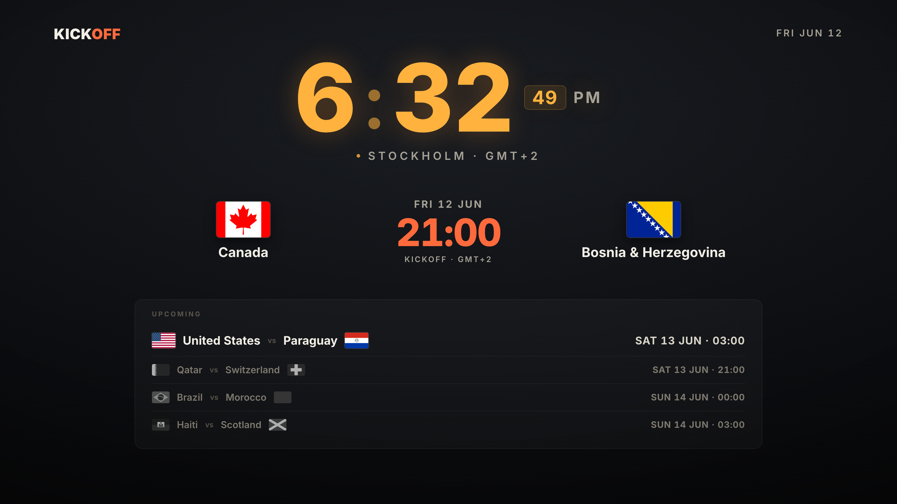

# Kickoff Clock — Simple Guide



## What is this?

A big, calm clock for your screen. It also shows the next **World Cup 2026**
football matches. It is one file. It works in any web browser.

## How to open it

Double-click **`kickoff-clock.html`**. It opens in your browser. No install.

- Press **F** or **double-click** the page to go full screen.
- Move the mouse to leave full screen.

## What you see (top to bottom)

- **Top left:** the name (KICKOFF).
- **Top right:** today's date.
- **Big amber clock:** your local time. 12-hour with **AM / PM**.
- **Under the clock:** your city and time zone.
- **Big match:** the next match. Shows its **date and time in Stockholm** (24-hour).
- **UPCOMING box:** the matches after that. The first one is bright.
  The rest are smaller and grey.

## It is also your Mac screensaver

This page is set as the Mac screensaver. After **5 minutes** with no mouse or
keys, it shows by itself.

## Change simple settings

Open `kickoff-clock.html` in a text editor. Near the top of the script you see:

```js
const CLOCK_TYPE      = '12h';   // '12h' = 5:47 PM   |   '24h' = 17:47
const SHOW_SECONDS    = true;    // small seconds on the clock
const LIVE_WINDOW_MIN = 120;     // minutes a match shows as "LIVE NOW"
const MATCH_TZ        = 'Europe/Stockholm';  // match times use this city
const UPCOMING_COUNT  = 4;       // how many matches in the box
```

Change a value, **save**, open the file again.

To change the clock colour, near the top of the style find `--clock:#FFB23E;`.

## Change the matches

In the same script, find `const FIXTURES = [ ... ]`. Each line is one match:
two teams and the kickoff time in **UTC**. On screen the time becomes
Stockholm time.

## Flags

Flags come from the internet. With no internet, simple drawn flags show instead.

## After you edit the file

The screensaver runs a **copy** of this file. If you change `kickoff-clock.html`,
copy it into the screensaver again so the screensaver updates too.

---

*More detail: see `README.md` (the full design brief) and `CLAUDE.md` (notes for
code tools).*
